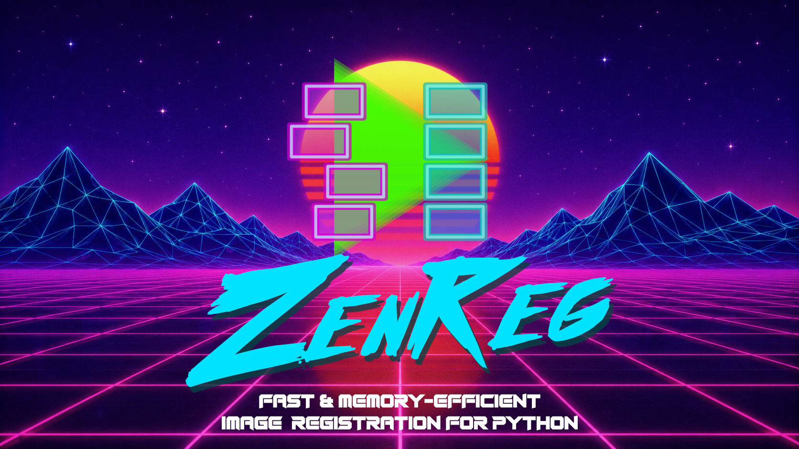

# ZenReg: Fast and memory-efficient N-dimensional microscopy image registration for Python


 [](https://pypi.org/project/zenreg/) [](https://zenreg.readthedocs.io/en/latest/overview.html#license)  [](https://github.com/FabrizioMusacchio/ZenReg/commits/main/)  [](https://codecov.io/gh/FabrizioMusacchio/ZenReg)  [](https://github.com/FabrizioMusacchio/ZenReg/issues) [](https://github.com/FabrizioMusacchio/ZenReg/issues?q=is%3Aissue%20state%3Aclosed) [](https://github.com/FabrizioMusacchio/ZenReg/pulls)  [](https://zenreg.readthedocs.io/en/latest/?badge=latest)  [](https://pypistats.org/packages/zenreg) [](https://pepy.tech/projects/zenreg)  [](https://doi.org/10.5281/zenodo.21727826)  [](https://zenreg.readthedocs.io)  





ZenReg is a Python package for modular microscopy image registration. It is
designed for time-resolved, volumetric, and multi-channel microscopy data and
uses a canonical `TZCYX` data model:

```text
T = time
Z = z slices
C = channels
Y = image rows
X = image columns
```

The main workflow is intentionally short:

```python
from zenreg import load_stack, register_stack, save_stack

image, metadata = load_stack("image.ome.tif", return_metadata=True)

registered, details = register_stack(
    image,
    registration_channel=0,
    method="phase_cross_correlation",
    return_shifts=True,
    return_details=True)

save_stack(
    "image_registered.ome.tif",
    registered,
    metadata=metadata,
    registration_details=details)
```

ZenReg writes registered OME-TIFF files together with optional CSV, YAML, and PNG report sidecars so registration settings and quality-control outputs remain reproducible and easy to share.


*Example image registration before and after ZenReg*

## What ZenReg is for
ZenReg is built for common microscopy registration tasks:

- 2D+t time-lapse registration with global XY motion.
- 2D+t in-plane rotation correction.
- 3D+t registration using fast Z projections or full ZYX volumes.
- 3D and 3D+t intra-stack XY slice correction.
- Full 3D rigid 6-DOF registration for structural volumes.
- NoRMCorre-style rigid and piecewise-rigid correction.
- Multi-channel registration where one channel is used for estimating motion
  and all channels are transformed consistently.
- Memory-efficient workflows for large microscopy files through OMIO-backed
  disk caches.

## Supported inputs
ZenReg uses [OMIO](https://github.com/FabrizioMusacchio/omio) for microscopy
I/O. OMIO normalizes supported inputs to canonical `TZCYX` arrays and returns a
metadata dictionary that ZenReg carries through to registered outputs.

Supported formats include:

- TIFF and OME-TIFF
- CZI
- LSM
- Thorlabs RAW

## Registration methods
ZenReg provides several registration backends through the same `register_stack`
wrapper:

| Method/backend | Main use |
| --- | --- |
| `phase_cross_correlation` | Fast translational registration on 2D projections or full 3D volumes. |
| `pystackreg` | StackReg-style 2D registration on projections. |
| `normcorre` | NoRMCorre-style rigid and piecewise-rigid correction without requiring CaImAn. |
| `rigid_3d_backend="simpleitk"` | Dense full 3D rigid-volume registration with physical Z/Y/X spacing. |
| `rigid_3d_backend="points"` | Sparse puncta/spot-based 3D rigid registration. |

## Memory-efficient processing
Large microscopy stacks can be read through OMIO disk-backed Zarr caches:

```python
from zenreg import cleanup_omio_cache, load_stack

memmap_folder = "/path/to/local/omio_cache"

image, metadata = load_stack(
    "large_server_file.ome.tif",
    return_metadata=True,
    use_memmap=True,
    memmap_folder=memmap_folder,
    memmap_reuse=True)
```

This is useful when files are larger than available RAM or when raw data live on
a server or network volume. A local cache lets ZenReg process chunked data from
fast local storage and reuse an existing validated cache across repeated
parameter tuning sessions. Cache cleanup is explicit:

```python
cleanup_omio_cache(memmap_folder, full_cleanup=True)
```

## Installation
ZenReg requires Python 3.12 or newer. The package has been tested with Python
3.12.

Create a fresh environment:

```bash
conda create -n zenreg -y python=3.12
conda activate zenreg
```

Install from PyPI:

```bash
pip install zenreg
```

Verify the installation:

```bash
python -c "import zenreg; print(f'ZenReg {zenreg.__version__} imported successfully; available CPUs: {zenreg.available_cpu_count()}')"
```

For a development checkout:

```bash
git clone https://github.com/FabrizioMusacchio/ZenReg.git
cd ZenReg
pip install -e ".[dev,docs]"
```

## Synthetic tutorial data
The tutorials use synthetic OME-TIFF datasets with matching ground-truth CSV
tables. Generate them with:

```bash
python additional_scripts/create_synthetic_example_data.py
```

This writes datasets into `example_data/synthetic_data/`. The repository keeps
`example_data/` as the tutorial data location, but the generated image data are
not intended to be committed.

Useful tutorial scripts:

- `user_scripts/register_synthetic_examples_interactive.py`
- `user_scripts/register_normcorre_synthetic_examples.py`
- `user_scripts/register_rigid3d_synthetic_examples.py`
- `user_scripts/register_batch_bids_like_synthetic.py`
- `user_scripts/profile_zenreg_memory_synthetic.py`

The scripts are structured with `# %%` cells for VS Code, Spyder, Jupyter-like
interactive execution, and napari inspection.

## Output files
When `registration_details` are passed to `save_stack`, ZenReg writes:

- `*_registered.ome.tif`: registered image with updated OMIO metadata.
- `*_registration_shifts.csv`: detected shifts, optional rotations, optional
  intra-stack shifts, and Pearson correlations before/after registration.
- `*_registration_settings.yaml`: settings and metadata needed to reproduce
  the registration.
- `*_registration_summary.png`: detected motion and correlation summary plot.

Additional tutorial helpers such as `show_before_after`, `show_timepoints`,
`show_slices`, and `open_in_napari` support visual quality control during
interactive analysis.

## Documentation
The full documentation is available on Read the Docs:

https://zenreg.readthedocs.io/

It includes installation instructions, synthetic data generation, 2D+t and 3D+t
registration tutorials, memory-efficient workflows, projection strategies,
napari inspection, result assessment, full 3D rigid registration, and batch
processing examples.

## License
ZenReg is distributed under the terms of the GNU General Public License v3.0 or
later. See [LICENSE](LICENSE) for details.

## Citation
If you use ZenReg in scientific work, please cite:

```text
Musacchio, F. (2026). ZenReg: Fast and memory-efficient N-dimensional microscopy image registration for Python. https://doi.org/10.5281/zenodo.21727826
```

