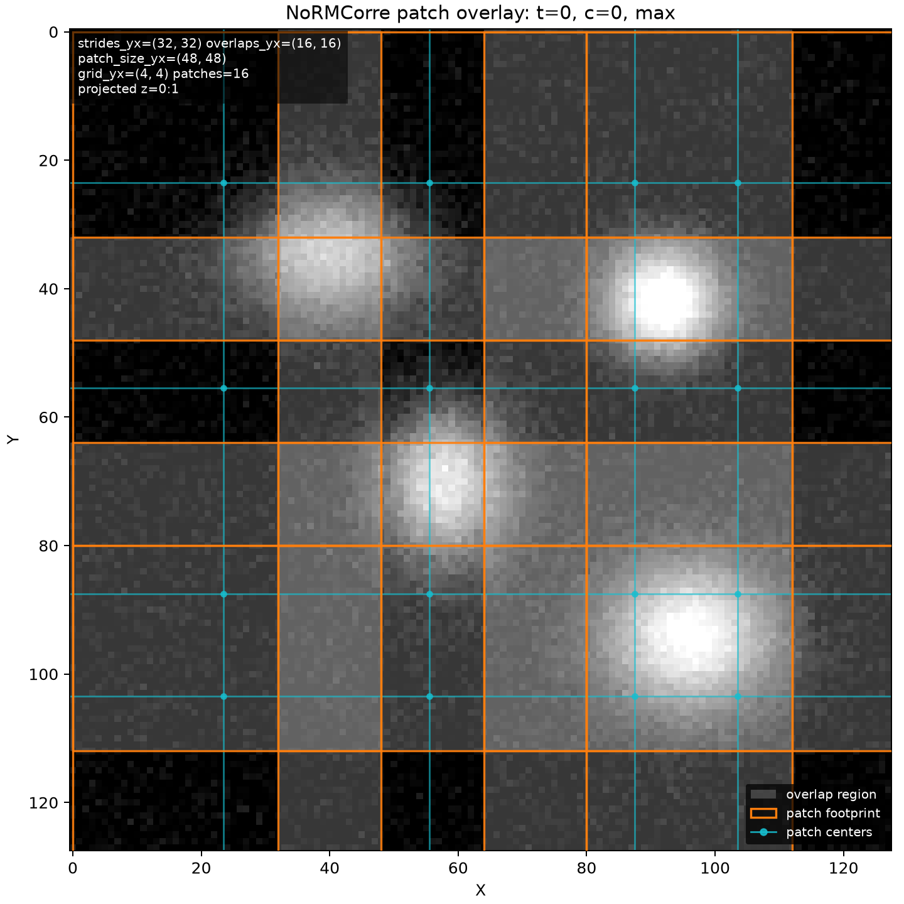

2D+t registration
=================

The 2D+t examples use stacks with shape ``T, 1, C, Y, X``. The registration
channel is used to estimate motion; the detected correction is then applied to
all channels.

Phase Cross-Correlation
-----------------------

Use ``phase_cross_correlation`` for fast global translation correction:

.. code-block:: python

   from pathlib import Path
   from zenreg import load_stack, register_stack, save_stack

   path = Path("example_data/synthetic_data/synthetic_2d_t_xy.ome.tif")
   image, metadata = load_stack(path, return_metadata=True)

   registered, details = register_stack(
       image,
       registration_channel   = 0,
       registration_stack     = 0,
       method                 = "phase_cross_correlation",
       time_registration_mode = "projection",
       time_reference_mode    = "template",
       projection_method      = "max",
       zreg                   = False,
       max_xy_shifts          = (8, 8),
       n_jobs                 = 4,
       return_shifts          = True,
       return_details         = True)

   save_stack(
       "example_data/synthetic_data/registered/2d_t_xy_phase_registered.ome.tif",
       registered,
       metadata             = metadata,
       registration_details = details)

``projection_method="max"`` is a good default for sparse spots or puncta.
``mean`` can be better for dense signals, while ``median`` is robust to
outliers but can attenuate sparse spots.

Options used here:

.. list-table::
   :header-rows: 1
   :widths: 36 64
   
   * - Argument
     - Meaning
   * - ``registration_channel``
     - Channel used to estimate shifts. The correction is applied to all
       channels.
   * - ``registration_stack``
     - Reference time point/template. Default: ``0``.
   * - ``method``
     - Registration backend. Default:  ``"phase_cross_correlation"``.
   * - ``time_registration_mode``
     - How time points are aligned. ``"projection"`` means that one YX
       projection is registered per time point. Default: ``"projection"``.
   * - ``time_reference_mode``
     - ``"template"`` aligns all frames to ``registration_stack``;
       ``"previous"`` accumulates frame-to-frame corrections. Default: ``"template"``.
   * - ``projection_method``
     - Z projection used for registration. For 2D+t data, Z is usually a
       singleton axis. Default:  ``"max"``.
   * - ``zreg``
     - Whether to estimate Z shifts. Default: ``False``.
   * - ``max_xy_shifts``
     - Optional absolute correction-shift limit as ``(max_y, max_x)``.  ``None`` means no XY clipping.
   * - ``n_jobs``
     - Number of CPU workers for independent frames/slices. ``-1`` uses all
       available workers. Default:  ``1``.
   * - ``return_shifts`` / ``return_details``
     - Return detected shifts or the full reproducibility/details dictionary. Both are ``False`` unless requested.

.. note::

   With ZenReg's helper function ``zenreg.available_cpu_count()``, you can 
   check how many CPU workers are available for your system.

pystackreg
----------

``pystackreg`` provides a StackReg-style 2D backend. In ZenReg, it operates on
the same YX projections:

.. code-block:: python

   registered, details = register_stack(
       image,
       registration_channel   = 0,
       registration_stack     = 0,
       method                 = "pystackreg",
       time_registration_mode = "projection",
       projection_method      = "max",
       zreg                   = False,
       max_xy_shifts          = (8, 8),
       return_shifts          = True,
       return_details         = True)

NoRMCorre
---------

NoRMCorre is available through the same main wrapper:

.. code-block:: python

   registered, details = register_stack(
       image,
       registration_channel   = 0,
       registration_stack     = 0,
       method                 = "normcorre",
       time_registration_mode = "projection",
       projection_method      = "max",
       nc_pw_rigid            = True,
       nc_strides             = (32, 32),
       nc_overlaps            = (16, 16),
       nc_max_deviation_rigid = 3,
       max_xy_shifts          = (8, 8),
       nc_n_jobs              = 4,
       return_shifts          = True,
       return_details         = True)

New options in this block:

.. list-table::
   :header-rows: 1
   :widths: 40 60
   
   * - Argument
     - Meaning
   * - ``nc_pw_rigid``
     - Enables piecewise-rigid patch correction instead of rigid-only
       NoRMCorre. Default: ``True``.
   * - ``nc_strides``
     - Patch-grid stride in YX. Default:  ``(48, 48)`` for 2D.
   * - ``nc_overlaps``
     - Patch overlap in YX. Effective patch size is
       ``nc_strides + nc_overlaps``. Default: ``(24, 24)`` for 2D.
   * - ``nc_max_deviation_rigid``
     - Maximum local patch deviation around the global rigid shift. ``None`` (default) means not limited.
   * - ``nc_n_jobs``
     - Worker count used by the NoRMCorre backend.  Default:  ``1``.

Before choosing ``nc_strides`` and ``nc_overlaps``, it is useful to draw the
patch layout. ZenReg provides a helper function for this:

.. code-block:: python

   from zenreg import plot_normcorre_patch_overlay

   plot_normcorre_patch_overlay(
       image,
       metadata,
       registration_channel = 0,
       registration_stack   = 0,
       nc_strides           = (32, 32),
       nc_overlaps          = (16, 16),
       projection_method    = "max",
       projection_range     = (0, 1))

   Example NoRMCorre patch layout for synthetic 2D+t data. The background is a
   maximum-intensity Z projection of the first time point. The orange grid shows
   the patch layout with stride 32 and overlap 16. The effective patch size is
   48x48 pixels. 

Memory-efficient workflow
-------------------------

Memory mapping is a central ZenReg concept and works beyond 2D+t. See
:doc:`usage_memory_efficient` for OMIO cache behavior, cache cleanup and reuse,
server/local-cache strategies, and backend support.

Rigid rotation correction
-------------------------

For 2D+t translation plus in-plane rotation, enable ``rotreg``. ZenReg first
estimates translation, then rotation from polar-transformed projections, then
runs a final translation refinement. Increase ``rotreg_iter`` to alternate
rotation and translation refinement more than once.

.. code-block:: python

   path = Path("example_data/synthetic_data/synthetic_2d_t_trans_rot_xy.ome.tif")
   image, metadata = load_stack(path, return_metadata=True)

   registered, details = register_stack(
       image,
       registration_channel   = 0,
       registration_stack     = 0,
       method                 = "phase_cross_correlation",
       time_registration_mode = "projection",
       projection_method      = "max",
       rotreg                 = True,
       max_rot_shifts         = 12,
       rotreg_iter            = 1,
       transform_backend      = "skimage",
       transform_order        = 1,
       return_shifts          = True,
       return_details         = True)

New options in this block:

.. list-table::
   :header-rows: 1
   :widths: 35 65

   * - Argument
     - Meaning
   * - ``method``
     - Backend used for the translational registration passes. Supported here:
       ``"phase_cross_correlation"`` and ``"pystackreg"``. Rotation estimation
       still uses internal polar-transform phase cross-correlation.
       ``"normcorre"`` currently does not support ``rotreg=True``.
   * - ``rotreg``
     - Enables in-plane XY/Z-axis rotation estimation from polar-transformed
       projections. Default:  ``False``.
   * - ``max_rot_shifts``
     - Optional absolute rotation limit in degrees. ``None`` (default) means no rotation clipping.
   * - ``rotreg_iter``
     - Number of translation/rotation refinement rounds. ``1`` runs
       translation, rotation, translation. Default:  ``1``.
   * - ``transform_backend``
     - Backend used to apply XY translations. Default:  ``"skimage"``. Alternative backend is ``"scipy"``.
   * - ``transform_order``
     - Interpolation order. ``1`` is good for intensity data; ``0`` preserves
       sparse puncta or labels. Default:  ``1``.

``method`` can be ``"phase_cross_correlation"`` or ``"pystackreg"`` in this
workflow. The selected method is used for the translational registration passes.
The rotation estimate itself is always computed internally from polar-transformed
projections using phase cross-correlation. ``method="normcorre"`` is currently
not supported together with ``rotreg=True``.

