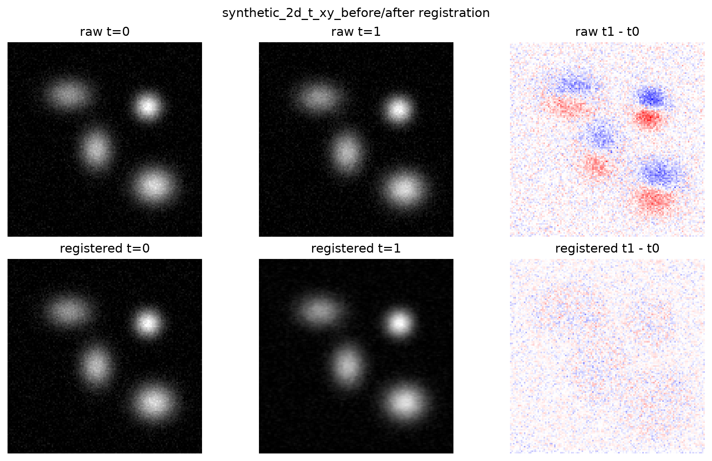
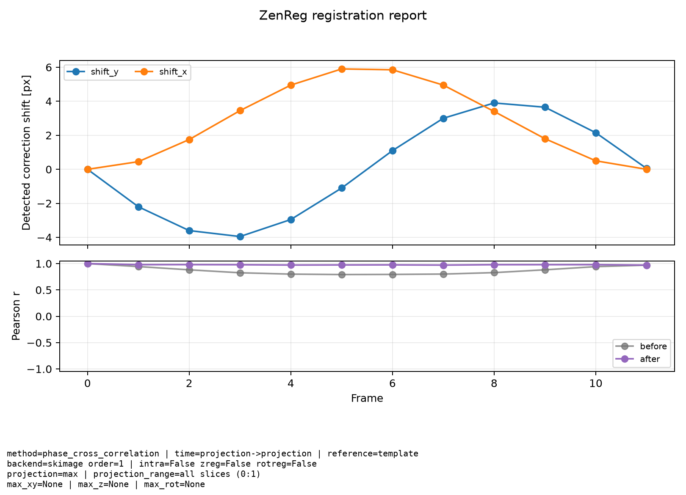

Assessing the results
=====================

Registration should always be checked before downstream analysis. ZenReg writes
registered images together with machine-readable sidecars and quick-look plots
so that visual inspection, quantitative quality control, and reproducibility
stay connected.

The minimal pattern is:

.. code-block:: python

   from pathlib import Path
   from zenreg import load_stack, register_stack, save_stack

   image, metadata = load_stack(
       Path("example_data/synthetic_data/synthetic_2d_t_xy.ome.tif"),
       return_metadata = True)

   registered, details = register_stack(
       image,
       registration_channel = 0,
       registration_stack   = 0,
       method               = "phase_cross_correlation",
       return_details       = True)

   written_path = save_stack(
       "example_data/synthetic_data/registered/synthetic_2d_t_xy_registered.ome.tif",
       registered,
       metadata             = metadata,
       registration_details = details,
       compression_level    = 3)

Passing ``registration_details`` to ``save_stack`` activates ZenReg's report
writer. ``compression_level`` is forwarded to OMIO's OME-TIFF writer; the
default is ``3``. For an output called ``image_registered.ome.tif``, ZenReg
writes:

.. list-table::
   :header-rows: 1

   * - Output
     - Purpose
   * - ``image_registered.ome.tif``
     - The registered image, written through OMIO with canonical ``TZCYX`` axes
       and updated metadata.
   * - ``image_registered_registration_shifts.csv``
     - Frame-wise shifts, optional intra-stack shifts, optional rotations, and
       Pearson correlations before and after registration.
   * - ``image_registered_registration_settings.yaml``
     - Reproducibility metadata: selected methods, backends, projection
       settings, limits, zero-clipping settings, and registered output shape.
   * - ``image_registered_registration_summary.png``
     - A compact summary plot for fast quality control.

Visual before/after checks
--------------------------

Use ``show_before_after`` for a quick residual plot. The raw difference image
should usually become flatter after registration, but it does not need to become
perfectly zero when the sample changes over time, photobleaches, has biological
activity, or contains noise.

.. code-block:: python

   from zenreg import show_before_after

   show_before_after(
       image,
       registered,
       title             = "synthetic 2D+t XY before/after registration",
       channel           = 0,
       reference_time    = 0,
       moving_time       = 1,
       projection_method = "max",
       save_dir          = "example_data/synthetic_data/registered/figures")

   Example result of a 2D+t registration using ZenReg's
   ``phase_cross_correlation`` backend. Top panels show from left to right the
   first and the second time point of the raw data, along with the difference
   image. Bottom panels show the same for the registered data.

Summary plots
-------------

The registration summary plot is meant as a first quantitative health check.
The upper panel shows detected correction shifts as a function of frame. If
``max_xy_shifts`` or ``max_z_shifts`` were set, dashed limit lines are drawn so
that clipped estimates are easy to spot. Red open markers indicate frames where
the raw detected shift exceeded a configured limit and was clipped before being
applied. When rotation registration is enabled, rotation estimates are shown on
a secondary axis as ``rotation_z``, ``rotation_y``, and/or ``rotation_x``
depending on the selected backend. Rotation estimates that exceeded
``max_rot_shifts`` are marked in the same way. For long time series, ZenReg
draws line traces without per-frame markers to keep the plot readable, while
limit-exceeded estimates remain marked as small red points.

The lower panel shows Pearson correlation between the registration template and
each frame. When available, ZenReg plots both the pre-registration and
post-registration correlations. A useful registration usually increases or
stabilizes these values, but the plot should be interpreted together with the
images: high correlation can still hide local errors, projection artefacts, or
unwanted cropping.

For large stacks, it is often useful to inspect the summary plot before spending
time writing the full registered OME-TIFF. Use
``write_registration_summary_plot`` directly after ``register_stack``:

.. code-block:: python

   from zenreg import write_registration_summary_plot

   write_registration_summary_plot(
       "example_data/synthetic_data/registered/"
       "synthetic_2d_t_xy_preview_registration_summary.png",
       registered,
       details)

This writes only the PNG summary plot. It does not save the registered image
and does not write the CSV or YAML sidecars.

   Example ZenReg summary plot. The plot records detected shifts, correlation
   before and after registration, and the most important settings used to
   create the registered image.

CSV reports
-----------

The shift CSV is useful for plotting, debugging, and benchmarking. It contains
one ``scope="time"`` row per time point and, when intra-stack correction was
used, additional ``scope="intra_stack"`` rows per time point and Z slice.

Important columns are:

.. list-table::
   :header-rows: 1

   * - Column
     - Meaning
   * - ``frame`` and ``z``
     - Time point and, for intra-stack rows, Z slice.
   * - ``shift_z``, ``shift_y``, ``shift_x``
     - Applied time-registration correction shifts in pixels. If maximum shift
       limits were set, these values may be clipped.
   * - ``shift_z_raw``, ``shift_y_raw``, ``shift_x_raw``
     - Raw detected correction shifts before optional clipping.
   * - ``shift_z_limit_exceeded``, ``shift_y_limit_exceeded``, ``shift_x_limit_exceeded``
     - ``True`` when the corresponding raw shift exceeded a configured limit and
       was clipped before application.
   * - ``intra_shift_y``, ``intra_shift_x``
     - Detected within-stack slice correction shifts.
   * - ``rotation_z_deg``, ``rotation_y_deg``, ``rotation_x_deg``
     - Applied correction rotations in degrees when rotation registration was
       enabled.
   * - ``rotation_z_deg_raw``, ``rotation_y_deg_raw``, ``rotation_x_deg_raw``
     - Raw detected rotations before optional clipping by ``max_rot_shifts``.
   * - ``rotation_z_limit_exceeded``, ``rotation_y_limit_exceeded``, ``rotation_x_limit_exceeded``
     - ``True`` when the corresponding raw rotation exceeded the configured
       rotation limit.
   * - ``pearson_correlation_before``
     - Template-vs-frame Pearson correlation before applying the detected
       registration, when available.
   * - ``pearson_correlation_after``
     - Template-vs-frame Pearson correlation after registration.

Load it like any other CSV table:

.. code-block:: python

   import pandas as pd

   shifts = pd.read_csv(
       "example_data/synthetic_data/registered/"
       "synthetic_2d_t_xy_registered_registration_shifts.csv")

   time_rows = shifts[shifts["scope"] == "time"]
   print(time_rows[["frame", "shift_y", "shift_x", "pearson_correlation_after"]])

YAML settings
-------------

The settings YAML is the reproducibility record for the registration run. It
contains the registered shape, canonical axes, summary correlation statistics,
paths to the report files, and the registration settings that affected the
result.

Use it to answer questions such as:

- Which channel and reference time point were used?
- Was registration projection-based or full 3D?
- Which projection method, registration Z range, and optional template time
  range created the template?
- Were Z shifts, rotations, zero clipping, or maximum shift limits enabled?
- Which transform backend and interpolation order were used?

Visual inspection with Napari
-----------------------------

Quantitative reports should be paired with direct visual inspection. Napari is
useful for checking whether residual motion is spatially structured, whether
zero-filled borders or cropping are acceptable, whether Z planes remain
plausibly aligned, and whether a registration that improves the global
correlation still leaves local errors.

Open raw and registered stacks as separate layers and compare them by toggling
visibility, changing blending modes, and stepping through time and Z:

.. code-block:: python

   from zenreg import open_in_napari

   OPEN_IN_NAPARI = True

   open_in_napari(
       image,
       metadata,
       fname   = "raw stack",
       enabled = OPEN_IN_NAPARI)

   open_in_napari(
       registered,
       metadata,
       fname   = "registered stack",
       enabled = OPEN_IN_NAPARI)

For large files, use the same memory-aware principle during inspection that you
used during registration. If ``image`` or ``registered`` is backed by an OMIO
Zarr cache, pass OMIO's Zarr opening mode through ZenReg's helper:

.. code-block:: python

   image, metadata = load_stack(
       "large_timeseries.ome.tif",
       return_metadata = True,
       use_memmap      = True,
       memmap_folder   = "local_omio_cache",
       memmap_reuse    = True)

   registered, details = register_stack(
       image,
       registration_channel = 0,
       method               = "phase_cross_correlation",
       output_use_memmap    = True,
       output_memmap_folder = "local_omio_cache",
       return_details       = True)

   open_in_napari(
       registered,
       metadata,
       fname     = "registered stack",
       enabled   = OPEN_IN_NAPARI,
       zarr_mode = "zarr_nodask")

With ``zarr_mode="zarr_nodask"``, OMIO opens the Zarr-backed array directly for
napari, so the viewer can request data as needed instead of forcing a full
dense copy before display. This matters for large time series and for workflows
where the input file lives on a server but the OMIO cache is local.

Practical interpretation
------------------------

For most datasets, use several checks together:

- Inspect raw and registered data in napari.
- Check the before/after residual plots for obvious remaining motion.
- Check whether shifts and rotations stay within biologically and technically
  plausible ranges.
- Compare correlation before and after registration.
- Inspect zero borders before enabling aggressive ``zero_clip`` settings.
- For synthetic examples, compare detected shifts and rotations against the
  ground-truth CSV tables.

Small residuals do not guarantee perfect registration, and perfect-looking
summary curves do not replace visual inspection. The goal is agreement between
the image, the detected motion parameters, and the correlation trend.
